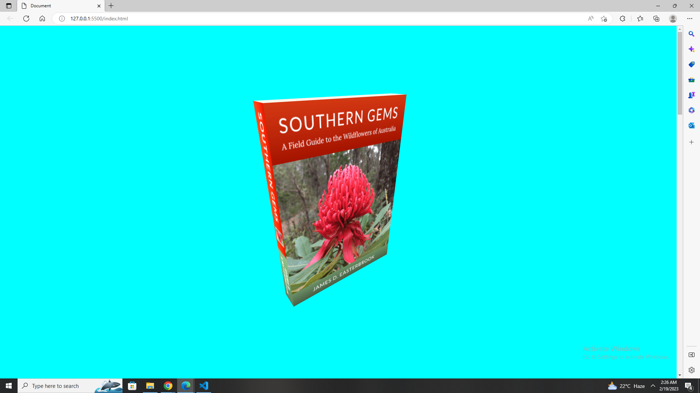

# Book Model using Three.js and Vanilla JS
 
  
 

### Live Link - https://book-threejs.netlify.app/

 

## Features
3D book model rendered using Three.js
Fully interactive with rotation and zoom-in features
Built with Vanilla JS for a lightweight and efficient web experience

## Getting Started
To view the book model, simply download or clone the repository and open index.html in your web browser. The model will load and you will be able to interact with it.

## Contributing
Contributions are always welcome! If you have any suggestions, improvements, or features you'd like to see, feel free to create an issue or pull request.

## Credits
Three.js library: https://threejs.org/

 

### Author Links  

👋 Hello,I am Shadman - Web developer

🚀 Follow me:  

  - [Github](https://github.com/sakibshadman19)
  - [LinkedIn](https://www.linkedin.com/in/shadman-sakib-95462923a/)
 
  
---
